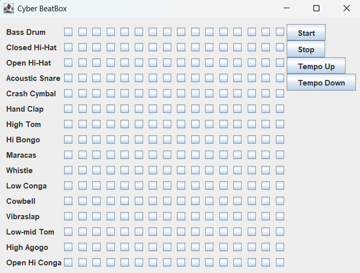

# BeatBox-CodeKitchen
# 🎵 BeatBox-CodeKitchen - Cyber Drum Machine in Java

BeatBox is a simple MIDI-based drum machine written in Java using the Java Swing and MIDI API. Inspired by classic drum sequencers, this program lets you create beats using a grid of checkboxes and play them using real-time MIDI sound.

---

## 🖥️ Features

- 16 different percussion instruments
- 16-step sequencer (16x16 grid)
- Start/Stop button to control playback
- Tempo adjustment (increase/decrease)
- Visual interface using Java Swing
- Real MIDI playback through the Java Sound API

---

## 📷 GUI Preview



---

## 🎛️ Instruments Included

- Bass Drum  
- Closed Hi-Hat  
- Open Hi-Hat  
- Acoustic Snare  
- Crash Cymbal  
- Hand Clap  
- High Tom  
- Hi Bongo  
- Maracas  
- Whistle  
- Low Conga  
- Cowbell  
- Vibraslap  
- Low-mid Tom  
- High Agogo  
- Open Hi Conga  

---

## 🚀 How to Run

### 🔧 Prerequisites

- Java JDK 8 or above
- A Java IDE (like IntelliJ IDEA, Eclipse) or just command-line tools

### 🧪 Steps to Compile & Run

```bash
# Compile
javac BeatBox.java

# Run
java BeatBox
